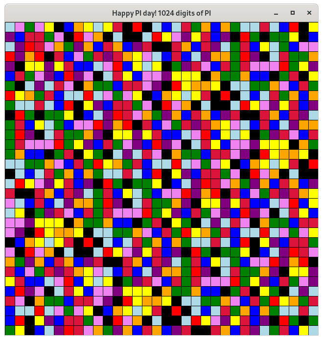

pi-day-2021-with-py

# Display digits of pi as a colored grid of squares using pallette of colors in Python


## Approach
For each digit of pi, display as a colored square mapped from a pallette.

When displaying 16 digits ...

```
3 1 4 1
5 9 2 6
5 3 5 8
9 7 9 3
```

## Run It
```
$ ./create_env
$ python -m display_pi --help
Usage: display_pi [--palette COLORS] [--num-digits N] [--width W] [--height H] [--help] [--version]

Options:
    --palette COLORS    where COLORS is a comma separated list of color names representing digits 0-9 [default: purple,violet,blue,lightblue,green,yellow,orange,red,crimson,black]
    --num-digits N      the number of digits of PI to display [default: 1000]

    --width W           the width of the display [default: 640]
    --height H          the height of the display [default: 640]

    --help              display this help text and exit
    --version           display version and exit

$ python -m display_pi --version
3.141592653589793

$ python -m display_pi

```

